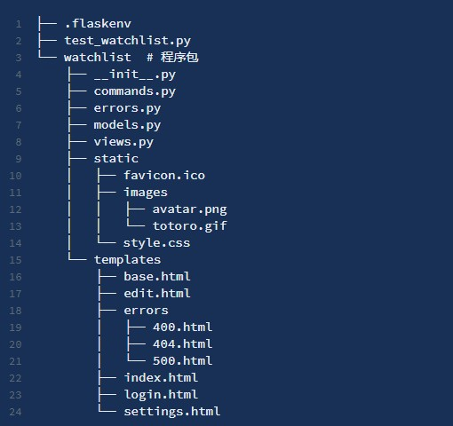

<center>flask 项目demo</center>

## 新建、使用虚拟环境[^1]
```shell script
python -m venv env

./Script/activate.bat
```

## 新建app.py并启动

```shell script
from flask import Flask
app = Flask(__name__)

@app.route('/')
def hello():
    return 'Welcome to My Watchlist!'
```
## jinjia模板使用[^2]
- {{ ... }} 用来标记变量。
-  用来标记语句，比如 if 语句，for 语句等。
- {# ... #} 用来写注释。

## 数据库orm工具SQLAlchemy[^3]

> SQLAlchemy是一款强大的orm工具， Flask-SQLAlchemy是python下flask插件

本项目使用的[sqlite](https://www.runoob.com/sqlite/sqlite-intro.html#:~:text=SQLite%E6%98%AF%E4%B8%80%E4%B8%AA%E8%BF%9B%E7%A8%8B%E5%86%85,%E7%9B%B4%E6%8E%A5%E8%AE%BF%E9%97%AE%E5%85%B6%E5%AD%98%E5%82%A8%E6%96%87%E4%BB%B6%E3%80%82)进程数据库

## 执行flask命令（程序发现机制）

需要在虚拟环境或相当于的python环境下执行

```shell script
 set FLASK_APP=hello
flask run 
```


## 用户认证[^4]

- User需要继承UserMix实现认证保存

## 代码组织



## 生成/使用requirements.txt

```shell script
pip freeze > requirements.txt
pip install -r requirements.txt

```
或下面这种[方式生成](https://blog.csdn.net/Irving_zhang/article/details/79087569)，可以解决中文编码路径造成的问题。首先定位到根目录，然后执行以下命令
```shell script
pipreqs ./ --encoding=utf8
```
参考资料

[^1]: helloflask.[c2-hello](https://read.helloflask.com/c2-hello).gitbook：未知

[^2]: 李辉.[第3章:模板](https://read.helloflask.com/c3-template).read.helloflask.com

[^3]: 李辉.[第5章：数据库](https://read.helloflask.com/c5-database).read.helloflask.com

[^4]: 李辉.[第8章：用户认证](https://read.helloflask.com/c8-login).read.helloflask.com